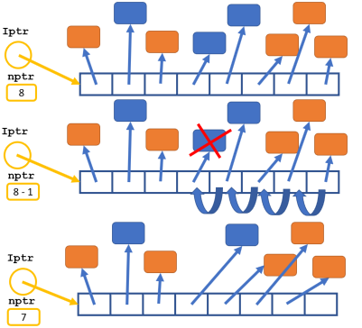

# Project: Simple Point Of Sale System

### Milestones

|Milestone| Revision | Approximate<br />Workload (days) | Overview | Comments |
|------|:---:|:----:|:----|:----| 
| [MS1](#milestone-1) | V0.9 | 5 | [Watch](https://youtu.be/2OWD-szjMIw)  |  |
| [MS2](#milestone-2) | V1.0 | 9|  [Watch](https://youtu.be/A9a4i5TChAc) |  |
| [MS3](#milestone-3) | V0.9| 10|  [Watch](https://youtu.be/5oL2RdYeWuo) | The text is being proof-read |
|   | V0.91| |   | Fixed few typos |
|   | V1.0| |   | Moved m_displayType to protected section for MS4 |
|   | V1.1| |   | corrected operator== definition |
|   | V1.2| |   | missing [itemType](#itemtype) function name is added  |
| [MS4](#milestone-4) | V0.9 | 4 |  |  The text is being proof-read  |
|  | V1.0 |  |  |  The [write oveload](#write-2) logic corrected   |
| [MS5](#milestone-5) | [m51](#ms51)-V0.9 | 14 | | The text is being proof-read |
|  | [m52](#ms52)-V0.9 |  | | The text is being proof-read |
|  | [m53](#ms53)-V0.9 |  | | The text is being proof-read |
|  | [m54](#ms54)-V0.9 |  | | The text is being proof-read |
|  | [m55](#ms55)-V0.9 |  | | The text is being proof-read<br />[posdataOrigin.csv](MS5/posdataOrigin.csv) file updated to accommodate the ms55 tester |


Your task for the project for this semester is to create simple Point of Sale (POS) application that keeps track of a small inventory of Goods to sell and can sell them at the cashier, issuing a bill of sale. 

## Milestones due dates
This project will be done in 5 milestones and each milestone will have its due date. The due date of each milestone is stated below, and it is based on the amount of work to be done for that milestone. 
## Final project mark and due dates

|Milestone| Mark | Due date | Submission Policy|
|:------:|:---:|:---:|-------|
| MS1 | 10% | Mar 10 | gets full mark even if 1 week late. gets 0% afterwards|
| MS2 | 10% | Mar 20 | gets full mark even if 1 week late. gets 0% afterwards|
| MS3 | 10% | Mar 29| gets full mark even if 1 week late. gets 0% afterwards|
| MS4 | 10% | Apr 2  | gets full mark even if 1 week late. gets 0% afterwards|
| MS5 | 60% |  Apr 16 | See below|

> To make the final submission of the project easier and to make it possible to partially submit a project we have divided the submission of milestone 5 into five small ones. Each submission is worth 12% of the project mark. Your project will be marked only if you have all four milestones and at least have one of the five submissions of milestone 5. 

|Milestone 5<br/> Divided into<br/>five submission| Mark | Due date | Submission Policy|
|:------|:---:|:---:|-------|
| [m51](#ms51) | 12% | Apr 16th | 10% penalty for each day being late up to 5 days|
| [m52](#ms52) | 12% | Apr 16th | 10% penalty for each day being late up to 5 days|
| [m53](#ms53) | 12% | Apr 16th | 10% penalty for each day being late up to 5 days|
| [m54](#ms54) | 12% | Apr 16th | 10% penalty for each day being late up to 5 days|
| [m55](#ms55) | 12% | Apr 16th | 10% penalty for each day being late up to 5 days|

> The first 4 milestones will not be marked based on the code, but their success and their timely submissions. You may modify or debug your previous code as you are going through the milestones. The only milestone that is going to scrutinized based your code will be milestone 5. If you require any feedback on your first four milestones you need to ask your professor to do so.


> :warning: The first four milestones must be submitted successfully even if they are very late.<br /> Your project will receive a mark of zero if any of the first 4 milestones are not submitted by the rejection date (Apr 21) . For your project to be marked, you must submit all the 4 milestones and at least one of the 5 submissions of Milestone 5 (Rejection date for milestone 5 is also Apr 21)

You can check the due date of each milestone using the ```-due``` flag in the submission command:
```bash
~profname.proflastname/submit 2??/prj/m? -due
```
- replace **2??** with the subject code
- replace **m?** with the milestone number
> Different sections may have different due dates based on their section's progress. Always check the due date using this command. The due date returned by this command always have priority over the due dates stated above.
## Citation, Sources

When submitting your work, all the files submitted should carry full student information along with the "citation and sources" information. See the following example:

If you have multiple submissions of the same milestone, please update the Revision History in each submission so your professor knows what changes to look for.

```C++
/* Citation and Sources...
Final Project Milestone ? 
Module: Whatever
Filename: Whatever.cpp
Version 1.0
Author	John Doe
Revision History
-----------------------------------------------------------
Date      Reason
2020/?/?  Preliminary release
2020/?/?  Debugged DMA
-----------------------------------------------------------
I have done all the coding by myself and only copied the code 
that my professor provided to complete my project milestones.
-----------------------------------------------------------
OR
-----------------------------------------------------------
Write exactly which part of the code is given to you as help and 
who gave it to you, or from what source you acquired it.
-----------------------------------------------------------*/
```

**Failing to include the above citation to any of the files containing your work will cause the rejection of your project submission**

#### See below for details:

### For work that is done entirely by you (ONLY YOU)

If the file contains only your work or the work provided to you by your professor, add the following message as a comment at the top of the file:

> I have done all the coding by myself and only copied the code that my professor provided to complete my project milestones.

### For work that is done partially by you.

If the file contains work that is not yours (you found it online or somebody provided it to you), **write exactly which part of the assignment is given to you as help, who gave it to you, or which source you received it from.**  By doing this you will only lose the mark for the parts you got help for, and the person helping you will be clear of any wrongdoing.


> :warning: This [Submission Policy](#submission-policy) only applies to the project. All other assessments in this subject have their own submission policies.

### If you have helped someone with your code

If you have helped someone with your code. Let them know of these regulations and in an email write exactly which part of your code was copied and who was the recipient of this code.<br />By doing this you will be clear of any wrongdoing if the recipient of the code does not honour these regulations.

## Compiling and Testing Your Program

All your code should be compiled using this command on `matrix`:

```bash
g++ -Wall -std=c++11 -g -o ms file1.cpp file2.cpp ...
```

- `-Wall`: the compiler will report all warnings
- `-std=c++11`: the code will be compiled using the C++11 standard
- `-g`: the executable file will contain debugging symbols, allowing *valgrind* to create better reports
- `-o ms`: the compiled application will be named `ms`

After compiling and testing your code, run your program as follows to check for possible memory leaks (assuming your executable name is `ms`):

```bash
valgrind --show-error-list=yes --leak-check=full --show-leak-kinds=all --track-origins=yes ms
```

- `--show-error-list=yes`: show the list of detected errors
- `--leak-check=full`: check for all types of memory problems
- `--show-leak-kinds=all`: show all types of memory leaks identified (enabled by the previous flag)
- `--track-origins=yes`: tracks the origin of uninitialized values (`g++` must use `-g` flag for compilation, so the information displayed here is meaningful).

To check the output, use a program that can compare text files.  Search online for such a program for your platform, or use *diff* available on `matrix`.


### Adding alias to `.bash_profile` on matrix
You can add the following two lines to the end of your `.bash_profile` file in your matrix home directory to create two aliases for the above C++ compilation and valgrind testing so you don't have to type such a long command to compile and execute your programs:
```bash
alias msc++="g++ -Wall -std=c++11 -g -o ms"
alias vrun="valgrind --show-error-list=yes --leak-check=full --show-leak-kinds=all --track-origins=yes"
```
By adding the above to the '.bash_profile' (you must logoff and log back it so it takes effect) you can compile your c++ files as follows:
```bash
msc++ file1.cpp file2.cpp file3.cpp...<ENTER>
```
The above will compile your files and if successful it will create an executable called `ms`.
```bash
vrun ms<ENTER>
```
The above will execute your `ms` executable under the tester `valgrind` for detailed test on leaks and runtime errors.

> Make sure that all the debugging code and debugging comments are removed before submission.

## Project Implementation notes:  *Very Important, read carefully*
- All the code written in this project should be within the namespace sdds.

- You are free and encouraged to add any attributes(member variables), functions and methods (member functions) you find necessary to complete your code. If you are not sure about your strategy for adding functionalities and properties to your classes, ask your professor for advice.  

- If any methods are being added and they are not called outside the scope of the class, make sure they are private.

- Unless you are asked for a specific definition, name the variables, and functions yourself. Use proper names and follow the naming conventions instructed by your professor. Having meaningless and misleading names will attract a penalty.

- When creating methods (member functions) make sure to make them constant if in their logic, they are not modifying their class.


- If an Empty state is required for an object, it is considered to be an “invalid” empty state, and objects in this state should be rendered unusable.

- A module called **Utils** is added to the project that can be used for your custom functions and classes in your implementation. Leave this module empty if you don't have any custom functionalities. <br />
You can add any custom code/class of your own to the **Utils** module to be used throughout the project. 

- Throughout the project, if any class is capable of printing, displaying or writing itself, the member function will always have the following signature:<br /> 
The function will return a reference of an **ostream** and will receive a reference on an **ostream** as an optional argument. If this argument is not provided, the object “**cout**” will be passed instead. 

- Throughout the project, if any class is capable of reading or receiving its content from a stream, the member function will always have the following signature:<br /> 
The function will return a reference of an **istream** and will receive a reference on an **istream** as an optional argument. If this argument is not provided, the object “**cin**” will be passed instead. 

- When passing an object or variable by address or reference, if they are not to be modified, make sure they are passed as constant pointers and references.

- You may reuse and copy any code your professor provided for your workshops or functions you may have from previous work in this subject or other subjects and place it in the Utils module. 


# The Point Of Sale system

We will start the development of the project by creating its user interface (MS1, PosApp module). Through this, we will create a mockup application that represents what the application will look like and act without actually doing anything. In short, we are creating a prototype of the application (in MS1) then coding its engine (in MS2, MS3 and MS4) and finally adding functionality to the POS system (MS1) to make it fully functional (in ms5, parts 1 to 5).

# Milestone 1
## The PosApp Module

This Module contains one Module called `PosApp`. This module is responsible to offer the user a menu of features provided by the POS system. 

The user, then, can select an option representing the feature and execute it. After the execution is complete, the system displays the menu again, until the user selects to exit the application.

### The features of the POS system

1. List Items
2. Add Item
3. Remove Item
4. Stock Item
5. Point Of Sale

### Implementation

For milestone 1 you are responsible to create a mockup module for the Point Of Sale that will demonstrate how the system is going to run (eventually) by only printing the name of the actions, instead of executing them. In later stages of development, you will replace these messages with the proper logic to actually perform the action. 

Note that the signature of many of the methods created now will be changed to accommodate what needs to be done.

#### The `PosApp` class

In module `PosApp` create a class with the same name (`PosApp`) having the following mandatory methods:

##### `menu` 

This method will display the menu of the system, and receive the user's choice (in a foolproof way and return the choice). See below:

```text
The Sene-Store
1- List items
2- Add item
3- Remove item
4- Stock item
5- Point of Sale
0- exit program
> a
Invalid Integer, try again: -1
[0<=value<=5], retry: > 6
[0<=value<=5], retry: > 1
Running listItems()
```

##### Mockup methods:

Create the following 7 methods that only print `Running` and their names.

1. addItem()
2. removeItem()
3. stockItem()
4. listItems()
5. POS()
6. saveRecs()
7. loadRecs()

##### Construction

`PosApp` is created by receiving the name of a file that is stored in character cString with a maximum length of 255 characters.

`PosApp` Can neither get copied nor assigned to another `PosApp` object. Your code must prevent such actions.

##### `run` method

> implement the following actions calling the corresponding mockup methods

This method first loads all the records and then displays the menu waiting for the user to make the selection. After the (foolproof) selection the proper action is executed and again the menu is displayed until the option exit is selected. In the latter case, all the records are saved and a `Goodbye!` message is displayed.

See the <a href="MS1/correct_output.txt" target="_blank">correct_output.txt</a> file for sample execution.

The tester file for this output is <a href="MS1/main.cpp" target="_blank">main.cpp</a>


## MS1 Submission 

### files to submit
```text
PosApp.cpp
PosApp.h
Utils.cpp
Utils.h
main.cpp
```

### Data entry
```text
abc
-1
6
1
2
3
4
5
0
```

### Submission Process

> If you would like to successfully complete the project and be on time, **start early** and try to meet all the due dates of the milestones.

Upload your source code and the tester program to your `matrix` account. Compile and run your code using the `g++` compiler [as shown in the introduction](#compiling-and-testing-your-program) and make sure that everything works properly.

Then, run the following command from your account (replace `profname.proflastname` with your professor’s Seneca userid):
```
~profname.proflastname/submit 2??/prj/m1
```
and follow the instructions.

- *2??* is replaced with your subject code


### The submit program's options:
```bash
~prof_name.prof_lastname/submit DeliverableName [-submission options]<ENTER>
[-submission option] acceptable values:
  "-due":
       Shows due dates only
       This option cannot be used in combination with any other option.
  "-skip_spaces":
       Do the submission regardless of incorrect horizontal spacing.
       This option may attract penalty.
  "-skip_blank_lines":
       Do the submission regardless of incorrect vertical spacing.
       This option may attract penalty.
  "-feedback":
       Check the program execution without submission.
```

## [Back to milestones](#milestones)

# Milestone 2
Start the second milestone by creating a general header file for the constant values needed throughout the development of the project. 

The name of this file is `POS.h`

Add the following constant values:
```text
TAX: 0.13
MAX_SKU_LEN: 7

MIN_YEAR: 2000
MAX_YEAR: 2030

MAX_STOCK_NUMBER: 99
MAX_NO_ITEMS: 2000
```
We may add more values to this header file later. If you need any constant value for your code, add it here.

## The Error Class

Create a class called Error. This class will be used as a smart flag in our future classes to keep track of the erroneous state of the object and the error message associated with it. 

The Error class has only a character pointer as an attribute that holds the description of the error (the error message) in a dynamic C-string. (We will call this pointer the **error message pointer** from now on).

> Note: naturally if the error message pointer is null, then the object is in a  **No Error** state and if the error message is not null, then there is an error and the description of the Error is pointed by the error message.

### Error Construction
- The Error class by default is in a "No Error" state. (its pointer is null) 
- The Error class can also get created using an error message (a C-string). In this case, the Error object will be in an erroneous state.

### Rule of three
The Error class can be copied and assigned to another Error object safely and must get destructed with no memory leak.

### Mandatory Operations
#### Assignment to a C-string.
An Error object should be able to be assigned to a C-string. This will set the error message to the content of the C-string dynamically or nullptr if the C-String is null or empty. 

#### boolean type conversion
If an Error object is casted to a **bool**, it should return true if the message is not null and false if it is null. 
```C++
  Error err;
  ...
  ...
  if(err){
      // there is an error
  }
  else{
      // there is no error
  }
```
#### `clear()` 
This method clears the error message and returns the reference of the current Error object. After this, the Error object should be in an "no Error" state with the message set to nullptr;

#### ostream insertion
The Error message should be able to be inserted into an ostream object using the **operator<<**. If the Error object is not in an error state nothing will be inserted into the ostream object.
> DO NOT use *friend* to implement this.

### Other Methods and operation
Implement and add any other method or operations you find necessary to accomplish the above tasks (make them private if they don't need to be publicly accessible)

## the Date class
### attributes
- The date class encapsulates date and time properties in five integer attributes (year, month, day, hour and minute).
- Date also has a flag for using date only (no hour or minutes)
- Finally, Date has an Error attribute to keep track of the success of operations. 

### Date validation process
During the implementation of the Date class whenever validation is needed the attributes of the date are all checked in the following order and the Error object is set to the corresponding error message stated below. 

#### Date values
The valid range of values for the year is defined in `POS.h`. Month values are between 1 and 12 and day values are between 1 and the return value of the [daysOfMonth ](#number-of-days-in-the-month-based-on-leap-year-calculation) function
#### Time values
The valid range for time value is 0 t 23 for the hour and  0 to 59 for the minute.

#### Validation Sequence
> Note that as soon as a validation fails, the Error object is set, and the rest of the validations will not take place

1. If the year is invalid, then the Error object is set to `"Invalid Year"`
2. If the month is invalid, then the Error object is set to `"Invalid Month"`
3. If the day is invalid, then the Error object is set to `"Invalid Day"`
4. If the hour is invalid, then the Error object is set to `"Invalid Hour"`
5. If the minute is invalid, then the Error object is set to `"Invalid Minute"`

### Already implemented utility functions
The following functions are already implemented to help you with implementing different functionalities in the Date class.
Use them (or their logic) wherever you find fit or necessary.

#### system date and time
The following function retrieves the current date and time of the system and returns them through the argument list.
```C++
#define _CRT_SECURE_NO_WARNINGS
#include <ctime>
   void getSystemDate(int& year, int& mon, int& day, int& hour, int& min, bool dateOnly) {
      time_t t = time(NULL);
      tm lt = *localtime(&t);
      day = lt.tm_mday;
      mon = lt.tm_mon + 1;
      year = lt.tm_year + 1900;
      if(dateOnly) {
         hour = min = 0;
      } else {
         hour = lt.tm_hour;
         min = lt.tm_min;
      }
   }
```
#### Unique Date and Time integer value retrieval
The following function assigns a unique integer value to a date-time value. Using this value you can compare two dates. (i.e if the unique value of one date is greater than the unique value of another date, then the first date is larger than the second one)
```C++
   int uniqueDateValue(int year, int mon, int day, int hour, int min) {
      return year * 535680 + mon * 44640 + day * 1440 + hour * 60 + min;
   }
```
#### Number of days in the month based on leap year calculation
To find out what is the maximum valid value for a calendar day in a month you can use this function. This function gets the year and the month and gives you the correct value for the number of days in that month (considering the leap year).
```C++
   int daysOfMonth(int year, int month){
      int days[] = { 31, 28, 31, 30, 31, 30, 31, 31, 30, 31, 30, 31, -1 };
      int mon = month >= 1 && month <= 12 ? month : 13;
      mon--;
      return days[mon] + int((mon == 1) * ((year % 4 == 0) && (year % 100 != 0)) || (year % 400 == 0));
   }
```
### Date Construction
- By default date is created and set to the current system date and will be set not to be date-only (it will include the hour and the minute)
- A date can get created by receiving the date; (year, month and day values only). In this case, the Date object will be set to date-only mode. After the attributes are set, they are [validated](#date-validation-process). 
- A date can get created using date and time; (year, month, day, hour and minute). In this case, the Date object will not be set to date-only mode. After the attributes are set, they are [validated](#date-validation-process).

### Comparison Operator Overloads
Overload all the comparison operator overloads to compare two date objects and return a boolean.

`(==, != , < , > , <= , >=)`

Make sure the references and methods are constant if they don't change the state of their objects and classes. 

### dateOnly Modifier method
Create a method called `dateOnly` that receives a boolean and returns the reference of the current date class. 

This method should set the date-only flag to the value received from the argument of the function. However, if the function argument is "true" which sets the object to date only, then the hour and minute attributes of the date should be set to zero.

In any case, the reference of the current object is returned.

### boolean type conversion operator
Overload the bool type conversion operator and return the opposite of the state of the error attribute. 

### the error query
Create a method called `error` that returns a constant reference of the error attribute object. This query does not change the state of the Date class.

### Other Methods and operation
Implement and add any other method or operations you find necessary to accomplish the above tasks (make them private if they don't need to be publicly accessible)

### ostream insertion operator overload
Overload the insertion operator to insert a Date into the ostream object. the result of the insertion should be as follows:

#### If the Date is not in an erroneous state
If the Date is in the date-only more, print the date in the following format: `YYYY/MM/DD`<br />
If the Date is not in the date-only mode, print the date and time in the following format: `YYYY/MM/DD, HH:MM`
#### if the Date is in an erroneous state
Insert the error attribute into ostream to print the error message held in the error attribute then print the date and time exactly as shown before but surrounding them with parenthesis.
```C++
Date A(2023,10,20);
Date B(2023,10,20,14,30);
Date C(2023,10,20,26,72);

cout << A << endl << B << endl << C << endl;
/* output:
2023/10/20
2023/10/20, 14:30
Invalid Hour(2023/10/20, 26:72)
*/
```
> DO NOT use friend to implement this. implement member functions to access the data instead.

### istream extraction operator overload
Overload the extraction operator to read a date from istream in the same format it is printed.

First, clear the error object to make sure the date is not in an erroneous state and set all the date and time attributes to zero.

Then read the date values by reading the five integers (if date and time) or the three integers (if date only), and ignoring the delimiters in the data entry. 

Note that you do not need to verify the delimiters to be exactly what the printed format is. 

For example, the following three date Entries are all valid:

```text
2023/10/20, 26:72  <<- date and time
2023-10-20*26-72   <<- date and time
2023_10_20         <<- date only
```
After reading each integer, check the status of istream, if it is not in a fail state, ignore the next character and read the next integer. If the istream is in a fail state, set the error object to the corresponding error message (see below) and skip the rest of the entries.  If all the integers were read successfully [validate](#date-validation-process) the date values. 

#### Error messages for istream failure

```text
"Cannot read year entry"
"Cannot read month entry"
"Cannot read day entry"
"Cannot read hour entry"
"Cannot read minute entry"
```

##### Exmaple

```text
2023/10/abc, 20:20
The Error message should be set to "Cannot read day entry" and extration is stopped having istream left in error sate
```

> Note if the Date is in read-only mode, after reading the three date integers, set hour and minute to zero.

In any case, at the end return the reference of istream.

## tester programs
Check each state of your program with the following testers. The main tester at submission combines all these tests.

- <a href="MS2/01-ErrorTester.cpp" target="_blank">01-ErrorTester.cpp</a> - <a href="MS2/01-output.txt" target="_blank">output</a>
- <a href="MS2/02-constantValueTests.cpp" target="_blank">02-constantValueTests.cpp</a> - <a href="MS2/02-output.txt" target="_blank">output</a>
- <a href="MS2/03-DateConstructorTests.cpp" target="_blank">03-DateConstructorTests.cpp</a> - <a href="MS2/03-output.txt" target="_blank">output</a>
- <a href="MS2/04-DateLogicalOperators.cpp" target="_blank">04-DateLogicalOperators.cpp</a> - <a href="MS2/04-output.txt" target="_blank">output</a>
- <a href="MS2/05-DateValidation.cpp" target="_blank">05-DateValidation.cpp</a> - <a href="MS2/05-output.txt" target="_blank">output</a>


## MS2 Submission 

> If you would like to successfully complete the project and be on time, **start early** and try to meet all the due dates of the milestones.

Upload your source code and the tester programs to your `matrix` account. Compile and run your code using the `g++` compiler [as shown in the introduction](#compiling-and-testing-your-program) and make sure that everything works properly.

Then, run the following command from your account (replace `profname.proflastname` with your professor’s Seneca userid):
```
~profname.proflastname/submit 2??/prj/m2
```
and follow the instructions.

- *2??* is replaced with your subject code


### The submit program's options:
```bash
~prof_name.prof_lastname/submit DeliverableName [-submission options]<ENTER>
[-submission option] acceptable values:
  "-due":
       Shows due dates only
       This option cannot be used in combination with any other option.
  "-skip_spaces":
       Do the submission regardless of incorrect horizontal spacing.
       This option may attract penalty.
  "-skip_blank_lines":
       Do the submission regardless of incorrect vertical spacing.
       This option may attract penalty.
  "-feedback":
       Check the program execution without submission.
```

## [Back to milestones](#milestones)

# Milestone 3

Before starting milestone 3, add the following constant values to `POS.h` header file:

## Additional constant values
```text
 MAX_NAME_LEN: 40

 POS_LIST: 1
 POS_FORM: 2

 ERROR_POS_SKU: "SKU too long"
 ERROR_POS_NAME: "Item name too long"
 ERROR_POS_PRICE: "Invalid price value"
 ERROR_POS_TAX: "Invalid tax status"
 ERROR_POS_QTY: "Invalid quantity value"
 ERROR_POS_STOCK: "Item out of stock"
 ERROR_POS_EMPTY: "Invalid Empty Item"
```

For the third milestone of the project, you will create two classes: `PosIO` and `Item`. Milestone 3 is dependent on the `Error` class only. (You do not need the other classes created in milestones 1 and 2 at this stage)

## PosIO interface 
Create a class called `PosIO` as an interface for console and file input and output operations. This class will only define 4 pure virtual methods and a virtual empty destructor. 

### Pure Virtual Methods
#### write
Receives and returns references of `ostream`. This method does not modify its owner.
#### read
Receives and returns references of `istream`. 
#### save
Receives and returns references of `ofstream`. This method does not modify its owner.
#### load
Receives and returns references of `ifstream`. 

### Insertion and Extraction operator overloads.
#### operator<<
Implement two insertion `operator<<` operator overloads that invoke the `write` and `save` pure virtual methods to work with `ostream` and `ofstream`.

#### operator>>
Implement two extraction `operator>>` operator overloads that invoke the `read` and `load` pure virtual methods to work with `istream` and `ifstream`.

## Item Abstract class
Create a class called `Item` to encapsulate an Item to be sold by the POS system. 

### Private Attributes
The Item class has the following mandatory attributes:
#### SKU
A C-string to keep an SKU code up to `MAX_SKU_LEN` characters.
#### Name
A dynamically allocated C-string to keep the name of the `Item` up to `MAX_NAME_LEN` characters.
#### Price
A double value
#### Taxed
A boolean that indicates if the Item is taxable or not.
#### Quantity 
An integer value for the stock number of the `Item`.  (number of items in the shop)

### Protect Attributes

#### diaplayType
An integer flag that can be either `POS_LIST` to display the Item in List mode or `POS_FORM` to display the Item in Form mode.
#### Error State
An Error object to keep the error status of the Item.

### Constructor
Item is instantiated using no arguments. In this case, an Item is set to an invalid Empty state (we will refer to this as `empty` from now on).

### Rule of three
An Item can be copied or assigned to another item safely and is destroyed with no memory leak.

### Member operator overloads
#### operator==
Compares an Item to a C-string and returns true if the C-sting is a match to the `SKU` code of the Item.
#### operator>
Compares two items alphabetically based on their names.
#### opertor+= 
Adds an integer value (right-hand operand) to the quantity and returns the quantity. If the sum of the value and the quantity exceeds the `MAX_STOCK_NUMBER` then the quantity will be set to `MAX_STOCK_NUMBER` and the Item error will be set to `ERROR_POS_QTY`.
#### operator-=
Reduces the quantity by the right-hand value and returns the quantity. If the value is more than the quantity then the quantity will be set to zero and the Item error will be set to `ERROR_POS_STOCK`.

#### bool type conversion
Returns the opposite of the status of the error attribute. This method does not modify the object.

### helper += operator overload
Overload the `operator+=` to receive a double reference as the left-hand operand and a constant reference of Item as the right-hand operator. This operator should add the product of [cost()](#cost-query) by [quantity()](#quantity-query) of the Item to the double operand and then return the value.

### Member function (Methods)

#### itemType

This pure virtual method returns a character as the type indicator of the item in future descendants of the Item. This method does not modify the object.
  
#### displayType
Receives an integer (`POS_LIST` or `POS_FORM`) and sets the corresponding attribute. This method returns the reference of the current object.

#### cost query
Returns the cost of the Item; that is the price of the item (plus tax if the item is taxable). This method does not modify the object.

#### quantity query
Returns the quantity of the Item. This method does not modify the object.

#### clear
Clears the error status of the object and then returns the reference of the current object.

### IO
Implement the four pure virtual methods of the base class as follows:
#### write
1. If in POS_LIST mode, it will print the object as follows:
```text
1234   |Screw Driver        |  12.32| X |  90|  1252.94|
4567   |Tape Measure - Level| 112.30|   |  10|  1123.00|
```
- Name: if longer than 20 characters, only the first 20 will be printed
- Taxed: if true `X` is printed or else space
- After the line is printed, no newlines are printed.

2. If in POS_FORM mode, it will print as follows:
```text
=============v
Name:        Screw Driver
Sku:         1234
Price:       12.32
Price + tax: 13.92
Stock Qty:   90
=============v
Name:        Tape Measure - Level - Laser - Combo
Sku:         4567
Price:       112.30
Price + tax: N/A
Stock Qty:   10
```
- At the end, a newline is printed.
3. If the Item is erroneous only the error object is printed (with no newline after).

In the end, the ostream reference is returned.

#### save
Save the data in a comma-separated format as follows:<br />
First, the [itemType](#itemtype-query) is printed and then all the attributes are saved separated by commas. No newline is saved at the end.<br />
In the following example, we assume the derived class's [itemType](#itemtype-query) function is returning 'T'.
```text
T,1234,Screw Driver,12.32,1,89
T,4567,Tape Measure - Level - Laser - Combo,112.30,0,9
```
If the Item is erroneous the error object is inserted into `cerr` and not the ofstream  (with a newline after).

In the end, the ofstream reference is returned.

#### read
Performs fool-proof data entry.

The attributes are read in the following order:<br />
SKU, Name, Price, Taxed or not and Quantity.

After each data entry, the value is validated, if invalid the [proper error message](#additional-constant-values) is printed and in the next line at the prompt (`>`) the value is re-entered. This repeats until a valid value is entered. See [Execution Sample](#execution-sample).

In the end, the reference of istream is returned.

```text
Sku
> 12345
Name
> Hammer
Price
> 23.99
Taxed?
(Y)es/(N)o: y
Quantity
> 35
```


#### load
First, the error status will be [clear](#clear-1)ed

Then reads all the values from the ifstream object in a comma-separated format (assuming the data begins with the SKU) in local variables (not directly into the attributes of the item). 

If after the reading the ifstream is not in a failure state, it will validate the values one by one and if any of the validation fails, the error message is set to the proper message and validation stops.

At the end of the validation process, if there is no error, the attributes are set to the validated values.

The reference of the ifstream object is returned at the end.

#### billPrint
This function will receive and return the ostream object.
The bill print function will only print the Name, taxed price, and if the item is taxed or not:
```text
| Screw Driver        |     13.92 |  T  |
| Tape Measure - Level|    112.30 |     |
```
- Name: only the first 20 characters are printed
- Taxed: if the item is taxed, `T` and otherwise, a space is printed.

### Tester program 
<a href="MS3/main.cpp" target="_blank">main.cpp</a>

### Execution sample
<a href="MS3/correct_output.txt" target="_blank">correct_output.txt</a>


## MS3 Submission 

### files to submit
```text
POS.h  
Error.cpp
Error.h
PosIO.cpp
PosIO.h
Item.cpp
Item.h
Utils.cpp  
Utils.h
main.cpp
```

> If you would like to successfully complete the project and be on time, **start early** and try to meet all the due dates of the milestones.

Upload your source code and the tester program to your `matrix` account. Compile and run your code using the `g++` compiler [as shown in the introduction](#compiling-and-testing-your-program) and make sure that everything works properly.

Then, run the following command from your account (replace `profname.proflastname` with your professor’s Seneca userid):
```
~profname.proflastname/submit 2??/prj/m3
```
and follow the instructions.

- *2??* is replaced with your subject code


### The submit program's options:
```bash
~prof_name.prof_lastname/submit DeliverableName [-submission options]<ENTER>
[-submission option] acceptable values:
  "-due":
       Shows due dates only
       This option cannot be used in combination with any other option.
  "-skip_spaces":
       Do the submission regardless of incorrect horizontal spacing.
       This option may attract penalty.
  "-skip_blank_lines":
       Do the submission regardless of incorrect vertical spacing.
       This option may attract penalty.
  "-feedback":
       Check the program execution without submission.
```


## [Back to milestones](#milestones)


# Milestone 4


## Non-perishable Item

Inherit a concrete class called `NonPerishable` from the `Item` class.

### itemType
Override the pure virtual function `itemType` and return the character `'N'` to identify this `Item` to be non-perishable.

### write 

Override the write function to complete the writing of an `Item` in `POS_LIST` and `POS_FORM`.

To accomplish this first call the write of the Base class and then if the Object is in a good state do the following:

If the display type is  `LIST` then print the following to indicate this `Item` does not have an expiry date:
```text
"     N / A   |"
```
If the display type is `FORM` close the data display by printing the following line and printing newline:
```text
"=============^"
```

If the object is not in a good state, nothing extra is printed.

# Perishable Item

Inherit a concrete class called `Perishable` from the `Item` class.

## Attribute

Add a `Date` attribute for the expiry date of the `perishable` item.

## Methods

### itemType
Override the pure virtual function `itemType` and return the character `'P'` to identify this `Item` to be `perishable`.


## Input and Output Methods
Override all the Input and output functions of the Base class as follows:

### read
Invoke the read of the Base class.

If the object is not in a good state or `istream` has failed, do nothing, otherwise, if the object and the `istream` are in a good state, create a local instance of Date and set it to date only. then prompt the user as follows: 
```text
Expiry date(YYYY/MM/DD)
> _
```
and extract the `date` from the `istream`. If the `date` is in a good state, set the expiry `date` to the extracted `date`, if not, set the error object of the Item to the error of the `Date`.  

### write
Invoke the write of the base class.

If the object is not in a good state, do nothing otherwise, If the object is in `POS_LIST` display mode print the `date` as follows: 

- space
- date 
- space
- `'|'`

If the object is in `POS_FORM` display mode print the `date` as follows:  

- `"Expiry date: "`
- Date
- newline
- `"=============^"`
- newline

### load
Invoke the load of the Base class.

If the object is not in a good state or `ifstream` has failed, do nothing, otherwise, if the object and the `ifstream` are in a good state, create a local instance of `Date` and set it to date only. Ignore one character to pass the `comma`. Then extract the `date` from the `ifstream`. If the `date` is in a good state, set the expiry date to the extracted `date`, if not, set the error object of the `Item` to the `error` of the `Date`.  

### save
Invoke the save of the Base class.

If the object is in a good state, insert a comma and then the expiry date into `ofstream`, otherwise, do nothing.

## Tester program

<a href="MS4/main.cpp" target="_blank">main.cpp</a>

## expected output

<a href="MS4/correct_output.txt" target="_blank">correct_output.txt</a>

## MS4 Submission 

### Files to submit

```text
POS.h 
Date.cpp                       
Date.h 
Error.h
Error.cpp
PosIO.h
PosIO.cpp  
Item.h
Item.cpp 
NonPerishable.h
NonPerishable.cpp
Perishable.h
Perishable.cpp  
Utils.h
Utils.cpp
main.cpp
nonPerInput.csv
perishableInput.csv
```

> If you would like to successfully complete the project and be on time, **start early** and try to meet all the due dates of the milestones.

Upload your source code and the tester program to your `matrix` account. Compile and run your code using the `g++` compiler [as shown in the introduction](#compiling-and-testing-your-program) and make sure that everything works properly.

Then, run the following command from your account (replace `profname.proflastname` with your professor’s Seneca userid):
```
~profname.proflastname/submit 2??/prj/m4
```
and follow the instructions.

- *2??* is replaced with your subject code


### The submit program's options:
```bash
~prof_name.prof_lastname/submit DeliverableName [-submission options]<ENTER>
[-submission option] acceptable values:
  "-due":
       Shows due dates only
       This option cannot be used in combination with any other option.
  "-skip_spaces":
       Do the submission regardless of incorrect horizontal spacing.
       This option may attract penalty.
  "-skip_blank_lines":
       Do the submission regardless of incorrect vertical spacing.
       This option may attract penalty.
  "-feedback":
       Check the program execution without submission.
```


## [Back to milestones](#milestones)


# Milestone 5

## MS5 submission 
Each submission tests one menu option of the PosApp and requires some of the functions of the PosApp of MS1 to be completed (implemented).

After completion of each section upload your updates to the matrix and issue the submission command for that part: 
```
~profname.proflastname/submit 2??/prj/m5#
```
- `??` is replaced with your subject code (`00` or `44`)
- `#` is replaced with the menu option number (`1` to `5`)

### Tester program
The tester program for all MS5 submissions is the same <a href="MS5/main.cpp" target="_blank">main.cpp</a> but each menu option has test data of its own.

### reflection 

Create a file called `reflect.txt` and add the following:  
- Citation, for any part of the code that is not yours. 
- Any additional (extra) work done that needs your professor's attention.
- Your overall reflection on the project and work done in the milestones (can be done only in your last submissions of milestone 5)

# Milestone 5 implementation

## The Bill class.
The bill class is fully implemented and uses the bprint method of the item to print a bill.

Study the Bill class and understand how it works.

## PosApp
Complete the code of the PosApp as follows

### Attributes
#### Data filename
A C-string (max 128 chars) to keep the data file name of items

#### Items pointer array
An array of Item pointers with the size `MAX_NO_ITEMS` (`MAX_NO_ITEMS` set to be 200 in POS.h; modify it if it is not 200) 

> we will call this array `Iptr` from now on

#### number of items
An attribute to hold the number of items in the PosApp. This number indicates how many of the `Iptr` pointers are used in the array to keep the items in the Inventory. 

> we will call this number `nptr` from now on


#### The action title
Every time an action title is requested print the following:
- print `">>>> "`
- print the title in 73 spaces, left justified filled with `'.'` character.

## MS51

### loadRecs Method
Implement the loadRecs method to load all the records of the data file into the `Iptr` array. Each `Iptr` pointer should point to a dynamically allocated Item (`Perishable` or `NonPerishable`).
- Print the action title `Loading Items`.
- open the data file in an `ifstream` object (we will call this `input` here).
- if opening the file was not successful create the file by opening and closing it using an `ofstream` object.
- Empty the `PosApp` class (make sure there are no Items in the `Iptr`)
- while the `input` is in a good state and the `Iptr` array is not full, 
    - read one character
    - create a dynamic Item (either `Perishable`, or `NonPershable`) based on the character being `P` or `N` and keep the address in the next available `Iptr` pointer
    - extract the Item from the `input` and add one to the `nptr`

### saveRecs
Implement the saveRecs to save all the items pointed by `Iptr` array in the data file.

- Print the action title `Saving Data`.
- Create an instance of ofstream using the data filename.
- loop through the Items pointed by the `Iptr` pointers and insert them into the ofstream instance up to `nptr`.


### listItems
- Print the action title `Listing Items`.
- <a href="https://intro2c.sdds.ca/F-Refinements/algorithms#sorting" target="_blank">Sort all the Items</a> in `Iptr` array based on their name in ascending order. 
- Print the Title/Header of the list: 
```text
 Row | SKU    | Item Name          | Price |TX |Qty |   Total | Expiry Date |
-----|--------|--------------------|-------|---|----|---------|-------------|
```
- Loop through the items up to `nptr` and display the row and the `Items` in `POS_LIST` format, calculating the total asset value of the `Items`.
- Print the footer and the total asset as follows:
```text
-----^--------^--------------------^-------^---^----^---------^-------------^
                               Total Asset: $  |       3567.13|
-----------------------------------------------^--------------^
```

## MS51 submission 

### Data entry
```text
1
0
```

### Output sample

<a href="MS5/m51_output.txt" target="_blank">ms51_output.txt</a>


### MS51 Submission command
```
~profname.proflastname/submit 2??/prj/m51 
```
## MS52

### addItem
Complete the implementation of addItem to add a new item to the inventory

- Print the action title `Adding Item to the store`.
- if the number of items is at maximum, print `"Inventory Full!"` and exit the function.  
- if not, create a pointer to an item and ask the user if the item is perishable
- Based on the user's answer dynamically create an instance of an Item (Perishable or NonPerishable) and keep the address in the Item pointer
- In a loop extract the item from cin
- if the item is not in a good state
    - clear cin
    - flush keyboard
    - insert the item into cout
    - insert `", try again...\n"`
    - repeat the loop
- if the item is in a good state add the item address to the next available element of `Iptr` and increase the `nptr`.
- Print the action title `DONE!`.

## MS52 submission test

### Data entry
```text
2
y
1111
Orange
3.99
n
20
2023/04/21
2
n
2222
Tea
12.22
y
10
0
```

### Expected output

<a href="MS5/m52_output.txt" target="_blank">ms52_output.txt</a>

### MS52 Submission command
```
~profname.proflastname/submit 2??/prj/m52
```
## [Back to milestones](#milestones)


## MS53
To be able to remove an item, you must first provide the facility to select an Item.

### selectItem 
Implement a method called selectItem() to list the items EXACTLY like the `listItems` function (except that the total asset is not shown) and then ask the user to select an Item by entering the row number, and then return that row number.

- Print the action title `Item Selection by row number`.
- Then pause so the user can see what action is being taken by printing this prompt:<br />`Press <ENTER> to start....`
- Print the action title `Listing Items`.
- List the items (see hint below)
- Prompt: `Enter the row number: `
- perform a fool-proof entry of an integer between 1 and the number of `Item`s listed.
- return the integer

> hint: It would be nice to have your `listItems` method receive a bool argument to turn the total asset display on and off so you can reuse the function here.

#### Execution example:  
Assuming there are only 7 items in the system:

```text
>>>> Item Selection by row number............................................
Press <ENTER> to start....
>>>> Listing Items...........................................................
 Row | SKU    | Item Name          | Price |TX |Qty |   Total | Expiry Date |
-----|--------|--------------------|-------|---|----|---------|-------------|
   1 | 5228   |7up 12 pack         |   6.49| X |  20|   146.67|  2017/05/31 |
   2 | 7913   |Banana              |   0.44|   |  99|    43.56|  2017/05/21 |
   3 | 3854   |Beefsteak Pie       |   5.29| X |  40|   239.11|  2017/05/25 |
   4 | 3456   |Bic Pen(Blue)       |   1.49| X |  80|   134.70|     N / A   |
   5 | 6458   |Blueberries         |   3.99|   |  30|   119.70|  2017/05/18 |
   6 | 4567   |Butter              |   4.56| X |   9|    46.38|  2017/05/15 |
   7 | 3815   |Chicken Alfredo     |   4.49| X |  20|   101.47|  2017/05/23 |
-----^--------^--------------------^-------^---^----^---------^-------------^
Enter the row number: abc
Invalid Integer, try again: -1
[1<=value<=7], retry: Enter the row number: 8
[1<=value<=7], retry: Enter the row number: 5
```
The function will return 5

### Remove Item
Prompt the user and remove an item by letting the user select the item from the list of items.

- Print the action title `Remove Item`.
- call the selectItem to get the row number of the Item (row number is index + 1 in `Iptr` array)
- print `Removing....` and show the item that is about to be removed in `POS_FROM` format.
- deallocate and remove the item from the `Iptr` array (see illustration)
- Print the action title `DONE!`.

```text
>>>> Remove Item.............................................................
>>>> Item Selection by row number............................................
Press <ENTER> to start....
>>>> Listing Items...........................................................
 Row | SKU    | Item Name          | Price |TX |Qty |   Total | Expiry Date |
-----|--------|--------------------|-------|---|----|---------|-------------|
   1 | 5228   |7up 12 pack         |   6.49| X |  20|   146.67|  2017/05/31 |
   2 | 7913   |Banana              |   0.44|   |  99|    43.56|  2017/05/21 |
   3 | 3854   |Beefsteak Pie       |   5.29| X |  40|   239.11|  2017/05/25 |
   4 | 3456   |Bic Pen(Blue)       |   1.49| X |  80|   134.70|     N / A   |
   5 | 6458   |Blueberries         |   3.99|   |  30|   119.70|  2017/05/18 |
   6 | 4567   |Butter              |   4.56| X |   9|    46.38|  2017/05/15 |
   7 | 3815   |Chicken Alfredo     |   4.49| X |  20|   101.47|  2017/05/23 |
-----^--------^--------------------^-------^---^----^---------^-------------^
Enter the row number: 5
Removing....
=============v
Name:        Blueberries
Sku:         6458
Price:       3.99
Price + tax: N/A
Stock Qty:   30
Expiry date: 2017/05/18
=============^
>>>> DONE!.................................................................

```
#### MS53 Illustration
In this illustration user has selected item number `4`.




## MS53 submission test
### Data entry
```text
3
<ENTER>
abc
-1
27
5
0
```
### Expected outcome

<a href="MS5/m53_output.txt" target="_blank">m53_output.txt</a>

### MS53 Submission command
```
~profname.proflastname/submit 2??/prj/m53 
```
## [Back to milestones](#milestones)

## MS54

### stockItem

When this option is selected, user will select an Item from the Items list and then the Item will be displayed on the screen in `POS_FORM` format. Then the user will be asked to add the number of items to be added to the quantity of the Item. This value can be between 1 and the current number of items minus the `MAX_STOCK_NUMBER`.
After the user enters the number, it will be added to the quantity of the Item. 

- Print the action title `Select an item to stock`.
- call the [seletItem method](#selectitem) and get the row number
- Print `Selected Item:\n`
- display the select Item
- Prompt `Enter quantity to add: `
- get and integer (fool-proof)
- Add the quantity to the item
- Print the action title `DONE!`.

### execution sample
```text
>>>> Select an item to stock.................................................
>>>> Item Selection by row number............................................
Press <ENTER> to start....
>>>> Listing Items...........................................................
 Row | SKU    | Item Name          | Price |TX |Qty |   Total | Expiry Date |
-----|--------|--------------------|-------|---|----|---------|-------------|
   1 | 5228   |7up 12 pack         |   6.49| X |  20|   146.67|  2017/05/31 |
   2 | 7913   |Banana              |   0.44|   |  99|    43.56|  2017/05/21 |
   3 | 3854   |Beefsteak Pie       |   5.29| X |  40|   239.11|  2017/05/25 |
   4 | 3456   |Bic Pen(Blue)       |   1.49| X |  80|   134.70|     N / A   |
   5 | 6458   |Blueberries         |   3.99|   |  30|   119.70|  2017/05/18 |
   6 | 4567   |Butter              |   4.56| X |   9|    46.38|  2017/05/15 |
   7 | 3815   |Chicken Alfredo     |   4.49| X |  20|   101.47|  2017/05/23 |
-----^--------^--------------------^-------^---^----^---------^-------------^
Enter the row number: 5
Selected Item:
=============v
Name:        Blueberries
Sku:         6458
Price:       3.99
Price + tax: N/A
Stock Qty:   30
Expiry date: 2017/05/18
=============^
Enter quantity to add: abc
Invalid Integer, try again: 0
[1<=value<=69], retry: Enter quantity to add: 70
[1<=value<=69], retry: Enter quantity to add: 10
>>>> DONE!.................................................................
```

## MS54 submission test
### Data entry

```text
4
<ENTER>
abc
-1
27
5
abc
0
70
10
0
```

### Expected output

<a href="MS5/m54_output.txt" target="_blank">m54_output.txt</a>

### MS54 Submission command
```
~profname.proflastname/submit 2??/prj/m54 
```
## [Back to milestones](#milestones)

## MS55
> The `posdataOrigin.csv` file is updated to accommodate the testing of this section, make sure to pull the change.

To finalize your project implement the `POS()` method of the `PosApp` Module.

In this method, you are to ask the user for the SKU of items to sell and if the SKU is found and the item is available (Quantity > 0) then reduce the quantity by one and add the item to the Bill and print the total price of the bill so far. 

If instead of entering the SKU user just hits enter with no data entry, then you will finalize the sale by printing the Bill.

### Execution sample
```text
>>>> Starting Point of Sale..................................................
Enter SKU or <ENTER> only to end sale...
> 1627
=============v
Name:        Peaches
Sku:         1627
Price:       1.44
Price + tax: N/A
Stock Qty:   13
Expiry date: 2017/06/01
=============^

>>>>> Added to bill
>>>>> Total: 1.44
Enter SKU or <ENTER> only to end sale...
> 4297
=============v
Name:        Lays Chips S&V
Sku:         4297
Price:       3.69
Price + tax: 4.17
Stock Qty:   0
Expiry date: 2017/05/26
=============^

>>>>> Added to bill
>>>>> Total: 5.61
Enter SKU or <ENTER> only to end sale...
> 4297
Item out of stock
Enter SKU or <ENTER> only to end sale...
> 1111
!!!!! Item Not Found !!!!!
Enter SKU or <ENTER> only to end sale...
>
v---------------------------------------v
| 2023/03/31, 10:44                     |
+---------------------v-----------v-----+
| Item                |     Price | Tax +
+---------------------v-----------v-----+
| Peaches             |      1.44 |     |
| Lays Chips S&V      |      4.17 |  T  |
+---------------------^-----------^-----+
| total:                     5.61 |
^---------------------------------^
```
### Implementation

To accomplish this we suggest the creation of a relatively simple method called `search` first. This method receives the SKU and returns the address of the item in the `Iptr` array if the matching SKU is found in the array, or otherwise nullptr.

Having this function to implement the POS() method do the following:

- Print the action title `Starting Point of Sale`.

Keep getting the SKU (up to MAX_SKU_LEN characters) in a local C-string Until the SKU is empty and in the loop:

- if SKU is not empty end the istream is not in a fail state
     - Search for the item
     - if found reduce the quantity by one and print the item in `POS_FORM` format.
          - If reduction was successful add the item to the bill and print<br /> `>>>>> Added to bill`<br />`>>>>> Total: <bill total so far>`
          - if the reduction was not successful, clear the error state of the item   
     - if not found print:<br />`!!!!! Item Not Found !!!!!`
- if istream is in a fail state print:<br />`SKU too long`<br /> and clear and flush the istream.

After the loop print the bill.

## MS55 submission test
### Data entry
```text
5
1111
9318
9318
4297
4297
1212
<ENTER>
0
```
### Expected outcome

<a href="MS5/m55_output.txt" target="_blank">m55_output.txt</a>

### MS55 Submission command
```
~profname.proflastname/submit 2??/prj/m55 
```
## [Back to milestones](#milestones)
